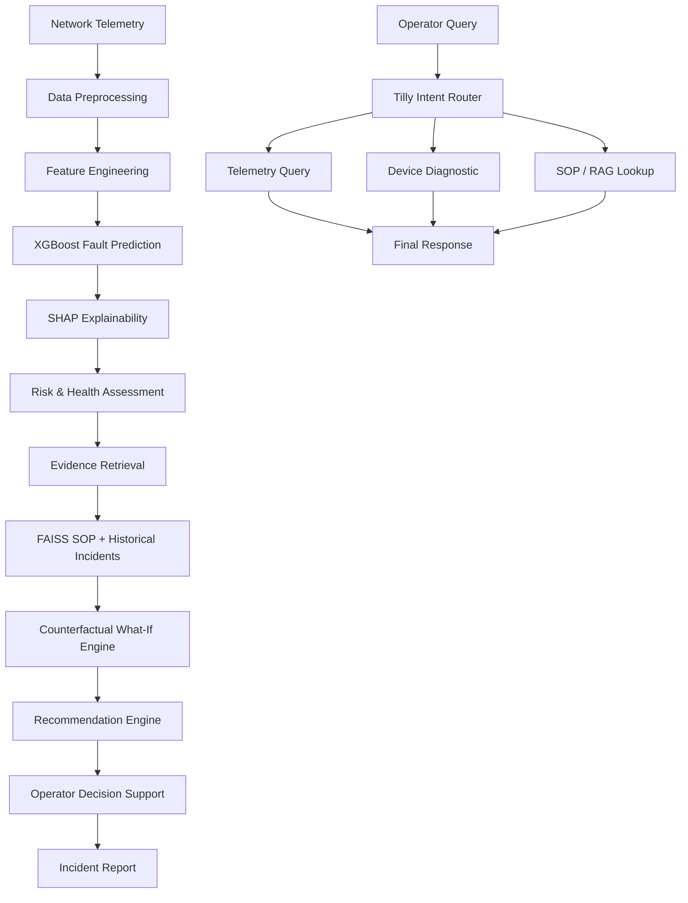

# NERVE NOC — Network Emergency & Risk Visualization Engine

### AI-Powered Telecom Network Diagnostic Command Center

NERVE NOC is an AI-powered **Network Operations Center (NOC) decision-support platform** designed for telecom fault prediction, explainable diagnostics, counterfactual analysis, historical evidence retrieval, and evidence-grounded troubleshooting.

Built using the **Telstra Network Disruptions dataset**, NERVE NOC transforms network telemetry into actionable diagnostic intelligence through machine learning, Explainable AI, Retrieval-Augmented Generation, and interactive what-if simulation.

Instead of simply answering **“Is this device likely to fail?”**, NERVE NOC helps operators understand:

> **What is wrong, why is it happening, what evidence supports the diagnosis, and what should the operator do next?**

---

## 🚀 Features

### 🔴 Fleet Command Center

* Fleet health aggregation
* Healthy / Warning / Critical device distribution
* Fleet risk score visualization
* Geographic risk visualization
* Network topology visualization
* Device search and severity filtering
* Batch incident report generation

### 🧠 Explainable Fault Prediction

* Multiclass fault prediction using **XGBoost**
* Feature-level explanations using **SHAP TreeExplainer**
* Operator-readable diagnostic explanations
* Device-level failure risk assessment
* Composite device health scoring

### 🔍 Evidence-Grounded Diagnostics

* Semantic retrieval using **FAISS**
* 16 technical telecom SOP playbooks
* Historical device incident retrieval
* Sentence Transformer embeddings
* Evidence-backed troubleshooting recommendations

### 🔄 What-If Counterfactual Simulator

* Modify network conditions interactively
* Recalculate relevant features
* Run model inference without retraining
* Compare projected risk levels
* Explore hypothetical interventions before taking action

### 🤖 Tilly — NOC Assistant

Tilly is the conversational diagnostic assistant built into NERVE NOC.

It intelligently routes operator queries to the appropriate system:

* **Telemetry Query** → Pandas/DataFrame execution
* **Device Diagnostic** → XGBoost prediction + SHAP
* **SOP Lookup** → FAISS retrieval
* **Historical Evidence** → Similar-device retrieval
* **General / Off-topic** → Domain guardrail

This hybrid approach reduces unnecessary dependence on LLMs for deterministic numerical queries.

### 📊 Interactive Operations Workspace

* Active incident stream
* Severity-based incident prioritization
* Interactive telemetry inference
* Device investigation workflow
* Diagnostic recommendations
* Incident PDF generation

### 🔐 Authentication

* Google OAuth 2.0 authentication
* Secure application access
* Development authentication mode for local testing

### 🌓 Modern NOC Interface

* Streamlit-based command center
* Interactive Plotly visualizations
* Responsive operational dashboards
* Network topology visualization
* Geographic risk visualization

---

## 🛠️ Tech Stack

### Machine Learning

* **XGBoost** — Multiclass fault classification
* **SHAP** — Explainable AI and feature attribution
* **Scikit-learn** — Preprocessing and evaluation
* **Pandas** — Telemetry and data processing
* **NumPy** — Numerical computation

### AI / RAG

* **FAISS** — Vector similarity search
* **Sentence Transformers** — SOP and incident embeddings
* **OpenRouter-compatible API** — Conversational reasoning
* **Hybrid Intent Routing** — Deterministic queries + AI-assisted diagnostics

### Frontend & Visualization

* **Streamlit** — NOC command center interface
* **Plotly** — Interactive charts and network visualizations

### Backend & Services

* **Python** — Core application and ML services
* **Google OAuth 2.0** — Authentication
* **Joblib** — Model persistence
* **JSON** — Playbook and application data storage
* **FPDF2** — Incident report generation

---

## 📐 System Architecture

### Architectural Flow

NERVE NOC follows an end-to-end diagnostic intelligence architecture:



The architecture connects **machine-learning inference, explainability, retrieval, simulation, and operator decision-making** in a single NOC workflow.

### Diagnostic Intelligence Pipeline

```text
Network Telemetry
       ↓
Feature Engineering
       ↓
XGBoost Fault Prediction
       ↓
SHAP Explainability
       ↓
Historical Evidence + SOP Retrieval
       ↓
Counterfactual Simulation
       ↓
Operator Recommendation
       ↓
Incident Report
```

This layered architecture allows NERVE NOC to move from **raw network data → prediction → explanation → evidence → simulation → actionable recommendation**.

---

## 🧩 Core Architecture

### 1. Data Layer

NERVE NOC uses:

* Telstra Network Disruptions dataset
* Technical SOP playbooks
* Historical device information

The system is designed for network-fault analysis and prototyping rather than live telecom infrastructure.

### 2. ML Layer

Telemetry-derived features are processed through preprocessing and feature engineering before being evaluated by a multiclass **XGBoost classifier**.

### 3. Explainability Layer

**SHAP TreeExplainer** identifies the features contributing most strongly to an individual fault prediction.

Instead of exposing raw model outputs, NERVE NOC converts important factors into operator-readable diagnostic context.

### 4. Retrieval Layer

FAISS indexes provide semantic retrieval over:

* Technical SOP playbooks
* Historical device incidents

Embeddings are generated using:

```text
all-MiniLM-L6-v2
```

### 5. Decision-Support Layer

The recommendation and counterfactual engines combine:

* Model predictions
* SHAP explanations
* Retrieved evidence
* Hypothetical scenario analysis

to provide actionable diagnostic context.

### 6. Operator Layer

Streamlit exposes the complete workflow through:

* Fleet monitoring
* Incident investigation
* Device diagnostics
* What-if simulation
* Tilly NOC Assistant

---

## 🔄 Diagnostic Workflow

```text
┌─────────────────────┐
│   Network Telemetry │
└──────────┬──────────┘
           ↓
┌─────────────────────┐
│ Feature Engineering │
└──────────┬──────────┘
           ↓
┌─────────────────────┐
│ XGBoost Prediction  │
└──────────┬──────────┘
           ↓
┌─────────────────────┐
│  SHAP Explanation   │
└──────────┬──────────┘
           ↓
┌─────────────────────┐
│ Evidence Retrieval  │
│   SOP + Incidents   │
└──────────┬──────────┘
           ↓
┌─────────────────────┐
│ What-If Simulation   │
└──────────┬──────────┘
           ↓
┌─────────────────────┐
│ Operator Recommendation │
└─────────────────────┘
```

---

## 🤖 Tilly — NOC Assistant

Tilly acts as the conversational intelligence layer of NERVE NOC.

Instead of forwarding every question directly to an LLM, Tilly first classifies the operator's intent.

```text
                 Operator Query
                       │
                       ▼
              Intent Classification
                       │
        ┌──────────────┼──────────────┐
        ▼              ▼              ▼
    Telemetry       Device         SOP / RAG
      Query        Diagnostic        Lookup
        │              │              │
        ▼              ▼              ▼
    DataFrame      Prediction       FAISS
    Execution       + SHAP         Retrieval
        │              │              │
        └──────────────┼──────────────┘
                       ▼
                 Final Response
```

### Supported Intents

| Intent              | Processing                        |
| ------------------- | --------------------------------- |
| Telemetry Query     | Direct Pandas/DataFrame execution |
| Device Diagnostic   | Device-specific prediction + SHAP |
| SOP Lookup          | FAISS semantic retrieval          |
| Historical Evidence | Similar-device retrieval          |
| General / Off-topic | Domain guardrail                  |

---

## 📊 Device Diagnostic Engine

The device diagnostic view combines multiple intelligence sources.

### Health & Risk

Displays:

* Composite device health score
* CPU utilization
* Memory utilization
* Network latency
* Packet loss
* Failure risk
* Estimated blast radius

### Explainable AI

For every prediction, SHAP identifies the features contributing most strongly to the classification.

Example:

```text
Prediction
    ↓
Severity: CRITICAL

Top Contributing Factors
    ├── Event Volume       → High Impact
    ├── Resource Usage     → High Impact
    ├── Network Condition  → Moderate Impact
    └── Location Pattern   → Moderate Impact
```

---

## 🔄 What-If Counterfactual Analysis

The simulator allows operators to investigate hypothetical changes to network conditions.

```text
Current Network Condition
          ↓
Modify Network Variable
          ↓
Recalculate Features
          ↓
Run Model Inference
          ↓
Compare Projected Risk
```

Example question:

> **“If the abnormal traffic volume were reduced, how would the predicted device risk change?”**

The simulator is a **model-based counterfactual analysis tool** and does not directly control network infrastructure.

---

## 📚 Evidence-Grounded SOP Retrieval

NERVE NOC indexes **16 technical SOP playbooks** using vector embeddings and FAISS.

```text
Operator Query
      ↓
Sentence Transformer
      ↓
Vector Embedding
      ↓
FAISS Similarity Search
      ↓
Relevant SOP / Historical Incident
      ↓
Diagnostic Context
```

Retrieved evidence is used to support troubleshooting recommendations rather than relying exclusively on generative model output.

---

## 📁 Project Structure

```text
NERVE-NOC/
│
├── app.py
├── requirements.txt
├── .env.template
├── README.md
│
├── data/
│   ├── raw/
│   │   └── telstra-network-disruptions/
│   │
│   └── playbooks/
│       └── telecom_sops.json
│
├── models/
│   ├── model.pkl
│   ├── location_freq_map.pkl
│   ├── faiss_playbooks.index
│   ├── playbook_summaries.pkl
│   ├── faiss_devices.index
│   └── device_summaries.pkl
│
└── src/
    ├── auth.py
    ├── features.py
    ├── llm_service.py
    ├── predictor.py
    ├── preprocessing.py
    ├── rag_service.py
    ├── recommender.py
    ├── topology.py
    └── what_if_engine.py
```

---

## 🧱 Module Responsibilities

| Module              | Responsibility                                |
| ------------------- | --------------------------------------------- |
| `app.py`            | Streamlit application and page orchestration  |
| `auth.py`           | Google OAuth authentication                   |
| `preprocessing.py`  | Dataset ingestion and preprocessing           |
| `features.py`       | Feature engineering                           |
| `predictor.py`      | XGBoost inference and SHAP explanation        |
| `rag_service.py`    | FAISS indexing and retrieval                  |
| `llm_service.py`    | Intent routing and LLM interaction            |
| `recommender.py`    | SOP matching and recommendation logic         |
| `what_if_engine.py` | Counterfactual simulation                     |
| `topology.py`       | Network topology and geographic visualization |

---

## ✨ Engineering Highlights

### Explainable Machine Learning

Uses **SHAP TreeExplainer** to expose why an individual prediction was made.

### Hybrid RAG Architecture

Combines deterministic telemetry computation with semantic retrieval rather than sending every query through an LLM.

### Multi-Index Retrieval

Maintains separate FAISS indexes for:

* Technical SOP knowledge
* Historical device incidents

### Counterfactual Analysis

Allows operators to evaluate hypothetical network changes and observe their impact on model predictions.

### Domain Guardrails

Tilly restricts conversational functionality to network-diagnostics-related requests.

### Operational Reporting

Diagnostic information can be converted into individual PDF incident reports or batch-exported as a ZIP archive.

---

## ✅ Implemented vs Roadmap

| Capability                         | Status        |
| ---------------------------------- | ------------- |
| Multiclass Fault Prediction        | ✅ Implemented |
| XGBoost Inference                  | ✅ Implemented |
| SHAP Explainability                | ✅ Implemented |
| Interactive What-If Simulation     | ✅ Implemented |
| Hybrid Intent Routing              | ✅ Implemented |
| FAISS SOP Retrieval                | ✅ Implemented |
| Historical Device Retrieval        | ✅ Implemented |
| 16 SOP Playbooks                   | ✅ Implemented |
| Device Diagnostic View             | ✅ Implemented |
| Network Topology Visualization     | ✅ Implemented |
| Geographic Risk Visualization      | ✅ Implemented |
| PDF Incident Reports               | ✅ Implemented |
| Google OAuth                       | ✅ Implemented |
| Kafka Telemetry Streaming          | 🗺️ Roadmap   |
| Live GIS / Tower GPS               | 🗺️ Roadmap   |
| Automated Self-Healing Remediation | 🗺️ Roadmap   |

---

## 🔮 Future Architecture

Future telemetry ingestion can be extended with streaming infrastructure:

```text
Kafka / Streaming Telemetry
          ↓
Stream Processing
          ↓
Feature Pipeline
          ↓
NERVE Prediction Engine
          ↓
Risk Detection
          ↓
Automated / Human-Approved Remediation
```

These are **roadmap components** and are not represented as implemented functionality in the current system.

---

## ⚙️ Local Development

### Prerequisites

* Python 3.10+
* Python 3.11 recommended
* Git

### Clone Repository

```bash
git clone https://github.com/your-username/NERVE-NOC.git
cd NERVE-NOC
```

### Create Virtual Environment

#### Windows

```bash
python -m venv venv
.\venv\Scripts\activate
```

#### Linux / macOS

```bash
python -m venv venv
source venv/bin/activate
```

### Install Dependencies

```bash
pip install -r requirements.txt
```

### Configure Environment

Copy `.env.template` to `.env`:

```bash
cp .env.template .env
```

Configure:

```env
OPENROUTER_API_KEY=your_openrouter_api_key_here
OPENROUTER_MODEL=openrouter/free

GOOGLE_CLIENT_ID=your_google_client_id_here
GOOGLE_CLIENT_SECRET=your_google_client_secret_here

DEV_AUTH=true
```

> **Security:** Never commit `.env`, API keys, OAuth secrets, or other credentials to the repository.

### Run Application

```bash
streamlit run app.py
```

Open:

```text
http://localhost:8501
```

---

## 📊 Dataset

NERVE NOC is built using the **Telstra Network Disruptions dataset**, which contains network event and service-disruption information suitable for developing predictive network-fault analysis workflows.

The dataset is used for **research and prototyping purposes** and does not represent live telecom infrastructure.

> Geographic coordinates displayed in the application are synthetic/anonymized visual positioning and should not be interpreted as real tower locations.

---

## 👥 Team

### NERVE NOC — Network Emergency & Risk Visualization Engine

* **Sivasakthi E** — Team Lead
* **Shiju S**
* **Geethanjali V N**
* **Shanmuga Sundaram S N**
* **Kishore S**

---

## 📌 Project Status

**Current Status:** Functional Prototype / Hackathon Implementation

NERVE NOC demonstrates an end-to-end architecture connecting:

```text
Data
 ↓
Feature Engineering
 ↓
Machine Learning
 ↓
Explainable AI
 ↓
Retrieval-Augmented Diagnostics
 ↓
Counterfactual Analysis
 ↓
Operator Decision Support
```

The architecture is intentionally modular, allowing production-oriented components such as streaming telemetry, live geospatial infrastructure data, model monitoring, and controlled remediation to be added independently.

---

## 📜 License

MIT License

---

### NERVE NOC

Predict. Explain. Investigate. Respond.

Turning network intelligence into faster, evidence-driven decisions.
