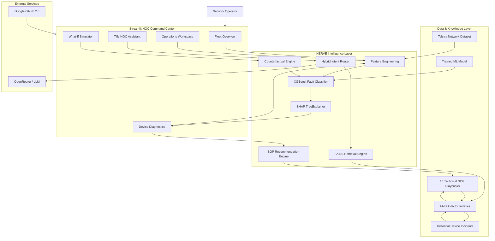

# NERVE NOC

### Network Emergency & Risk Visualization Engine

> **AI-powered network operations command center for telecom fault prediction, explainable diagnostics, counterfactual analysis, and evidence-grounded troubleshooting.**

NERVE NOC is a machine-learning-powered **Network Operations Center (NOC) decision-support system** built on the **Telstra Network Disruptions dataset**.

Instead of stopping at *“this device is likely to fail,”* NERVE NOC combines **fault prediction, explainability, historical evidence retrieval, what-if simulation, and SOP verification** into a single diagnostic workflow.

The system is designed around a practical NOC question:

> **What is wrong, why is it happening, what evidence supports the diagnosis, and what should the operator do next?**

---

## Why NERVE NOC?

Traditional fault prediction systems often produce a prediction without enough context for an operator to act on it.

NERVE NOC extends the prediction pipeline into an operator-facing diagnostic workflow:

```text
Telemetry
   ↓
Feature Engineering
   ↓
XGBoost Fault Prediction
   ↓
SHAP Explainability
   ↓
Historical Evidence + SOP Retrieval
   ↓
Counterfactual Simulation
   ↓
Operator Recommendation
   ↓
Incident Report
```

This creates a bridge between **machine-learning inference** and **NOC operational decision-making**.

---

## System Architecture



### Architectural Flow

**1. Data Layer**

The system uses the Telstra Network Disruptions dataset together with indexed technical SOP documents and historical device information.

**2. ML Layer**

Telemetry-derived features are passed through preprocessing and feature engineering before being evaluated by a multiclass XGBoost classifier.

**3. Explainability Layer**

SHAP `TreeExplainer` calculates feature-level contributions for individual predictions, allowing operators to understand the primary factors influencing a fault classification.

**4. Retrieval Layer**

FAISS indexes provide semantic retrieval over:

* Technical SOP playbooks
* Historical device incidents

Sentence Transformers generate embeddings using `all-MiniLM-L6-v2`.

**5. Decision-Support Layer**

The recommendation and counterfactual engines translate model outputs and retrieved evidence into actionable diagnostic context.

**6. Operator Layer**

Streamlit exposes the complete workflow through fleet monitoring, incident investigation, device diagnostics, simulation, and the Tilly NOC Assistant.

---

# Core Capabilities

## 1. Fleet Command Center

A high-level operational view of the monitored network.

**Capabilities**

* Fleet health aggregation
* Healthy / Warning / Critical distribution
* Fleet risk score visualization
* Geographic risk visualization
* Network topology visualization
* Device search and severity filtering
* Batch incident report generation

The geographic visualization uses **synthetic coordinates derived from anonymized location identifiers** rather than real tower GPS data.

---

## 2. Operations Workspace

Provides an interactive environment for investigating network conditions.

### Active Incident Stream

Incidents are prioritized by severity and can be opened directly for deeper investigation.

### Interactive Telemetry Inference

Operators can modify telemetry-related inputs and run the trained XGBoost model to observe changes in predicted fault severity.

This provides an interactive inference sandbox without requiring a new model training cycle.

---

## 3. Device Diagnostic Engine

The device detail view combines multiple sources of intelligence into one diagnostic workflow.

### Health & Risk

Displays:

* Composite device health score
* CPU utilization
* Memory utilization
* Network latency
* Packet loss
* Failure risk
* Estimated blast radius

### Explainable AI

For each prediction, SHAP identifies the features contributing most strongly to the classification.

Instead of exposing raw model values alone, NERVE translates important features into operator-readable explanations.

Example:

```text
Prediction
    ↓
Severity: CRITICAL

Top contributing factors
    ├── Event volume       → High impact
    ├── Resource usage     → High impact
    ├── Network condition  → Moderate impact
    └── Location pattern  → Moderate impact
```

---

## 4. What-If Counterfactual Simulator

The simulator allows operators to explore hypothetical interventions before taking action.

For example:

```text
Current network condition
          ↓
Reduce anomaly / traffic volume
          ↓
Recalculate feature values
          ↓
Run model inference
          ↓
Compare projected risk
```

This allows operators to investigate questions such as:

> **“If the abnormal traffic volume were reduced, how would the predicted device risk change?”**

The simulator is a **model-based counterfactual analysis tool**, not an automated network-control system.

---

## 5. Evidence-Grounded SOP Verification

NERVE NOC indexes **16 technical SOP playbooks** using vector embeddings and FAISS.

The retrieval pipeline is:

```text
Operator Query
      ↓
Sentence Transformer
      ↓
Vector Embedding
      ↓
FAISS Similarity Search
      ↓
Relevant SOP / Historical Incident
      ↓
Diagnostic Context
```

Retrieved evidence is used to support troubleshooting recommendations rather than relying solely on generative model output.

---

# Tilly — NOC Assistant

**Tilly** is the conversational diagnostic interface inside NERVE NOC.

Instead of sending every query directly to an LLM, Tilly first determines the type of request.

```text
                    Operator Query
                         │
                         ▼
                  Intent Classification
                         │
          ┌──────────────┼──────────────┐
          ▼              ▼              ▼
     Telemetry        Device          SOP / RAG
      Query          Diagnostic        Lookup
          │              │              │
          ▼              ▼              ▼
     DataFrame       Prediction       FAISS
     Execution       + SHAP           Retrieval
          │              │              │
          └──────────────┼──────────────┘
                         ▼
                    Final Response
```

### Supported Intent Categories

| Intent              | Processing                          |
| ------------------- | ----------------------------------- |
| Telemetry Query     | Direct Pandas/DataFrame execution   |
| Device Diagnostic   | Device-specific model + explanation |
| SOP Lookup          | FAISS semantic retrieval            |
| Historical Evidence | Similar-device retrieval            |
| General / Off-topic | Domain guardrail                    |

This routing approach reduces unnecessary LLM dependence for deterministic numerical queries.

---

# Technology Stack

| Layer           | Technology                | Purpose                              |
| --------------- | ------------------------- | ------------------------------------ |
| UI              | Streamlit                 | NOC command center                   |
| Visualization   | Plotly                    | Interactive charts and network views |
| ML              | XGBoost                   | Multiclass fault classification      |
| Explainability  | SHAP                      | Feature-level model explanations     |
| ML Utilities    | Scikit-learn              | Preprocessing and evaluation         |
| Data Processing | Pandas, NumPy             | Telemetry processing                 |
| RAG             | FAISS                     | Vector similarity retrieval          |
| Embeddings      | Sentence Transformers     | SOP / incident embeddings            |
| LLM             | OpenRouter-compatible API | Conversational reasoning             |
| Backend         | Python                    | Application and ML services          |
| Reporting       | FPDF2                     | Incident PDF generation              |
| Authentication  | Google OAuth 2.0          | User authentication                  |
| Persistence     | Joblib, JSON              | Models and playbook storage          |

---

# Project Structure

```text
NERVE-NOC/
│
├── app.py
├── requirements.txt
├── .env.template
├── README.md
│
├── data/
│   ├── raw/
│   │   └── telstra-network-disruptions/
│   │
│   └── playbooks/
│       └── telecom_sops.json
│
├── models/
│   ├── model.pkl
│   ├── location_freq_map.pkl
│   ├── faiss_playbooks.index
│   ├── playbook_summaries.pkl
│   ├── faiss_devices.index
│   └── device_summaries.pkl
│
└── src/
    ├── auth.py
    ├── features.py
    ├── llm_service.py
    ├── predictor.py
    ├── preprocessing.py
    ├── rag_service.py
    ├── recommender.py
    ├── topology.py
    └── what_if_engine.py
```

### Module Responsibilities

| Module              | Responsibility                                |
| ------------------- | --------------------------------------------- |
| `app.py`            | Streamlit application and page orchestration  |
| `auth.py`           | Google OAuth authentication                   |
| `preprocessing.py`  | Dataset ingestion and preprocessing           |
| `features.py`       | Feature engineering                           |
| `predictor.py`      | XGBoost inference and SHAP explanation        |
| `rag_service.py`    | FAISS indexing and retrieval                  |
| `llm_service.py`    | Intent routing and LLM interaction            |
| `recommender.py`    | SOP matching and recommendation logic         |
| `what_if_engine.py` | Counterfactual simulation                     |
| `topology.py`       | Network topology and geographic visualization |

---

# Engineering Highlights

### Explainable ML

Uses SHAP TreeExplainer to expose **why an individual prediction was made**, rather than treating the classifier as a black box.

### Hybrid RAG Architecture

Combines deterministic telemetry computation with semantic retrieval instead of routing every question through an LLM.

### Multi-Index Retrieval

Maintains separate FAISS indexes for:

* Technical SOP knowledge
* Historical device incidents

This enables retrieval from both procedural knowledge and historical evidence.

### Counterfactual Analysis

Allows operators to evaluate hypothetical changes to network conditions and observe the resulting model prediction.

### Domain Guardrails

Tilly restricts conversational functionality to the network-diagnostics domain and prevents unrelated queries from being treated as technical requests.

### Operational Reporting

Diagnostic information can be converted into individual PDF incident reports or batch-exported as a ZIP archive.

---

# Implemented vs Roadmap

| Capability                         | Status |
| ---------------------------------- | :----: |
| Multiclass Fault Prediction        |    ✅   |
| XGBoost Inference                  |    ✅   |
| SHAP Explainability                |    ✅   |
| Interactive What-If Simulation     |    ✅   |
| Hybrid Intent Routing              |    ✅   |
| FAISS SOP Retrieval                |    ✅   |
| Historical Device Retrieval        |    ✅   |
| 16 SOP Playbooks                   |    ✅   |
| Device Diagnostic View             |    ✅   |
| Network Topology Visualization     |    ✅   |
| Geographic Risk Visualization      |    ✅   |
| PDF Incident Reports               |    ✅   |
| Google OAuth                       |    ✅   |
| Kafka Telemetry Streaming          |   🗺️  |
| Live GIS / Tower GPS               |   🗺️  |
| Automated Self-Healing Remediation |   🗺️  |

### Future Architecture

The current system is designed so that future telemetry ingestion can be extended with:

```text
Kafka / Streaming Telemetry
          ↓
Stream Processing
          ↓
Feature Pipeline
          ↓
NERVE Prediction Engine
          ↓
Risk Detection
          ↓
Automated / Human-approved Remediation
```

These components are **roadmap items and are not represented as implemented functionality in the current system**.

---

# Local Development

## Prerequisites

* Python 3.10+
* Python 3.11 recommended
* Git

## Clone

```bash
git clone https://github.com/your-username/NERVE-NOC.git
cd NERVE-NOC
```

## Create Virtual Environment

### Windows

```bash
python -m venv venv
.\venv\Scripts\activate
```

### Linux / macOS

```bash
python -m venv venv
source venv/bin/activate
```

## Install Dependencies

```bash
pip install -r requirements.txt
```

## Configure Environment

Copy `.env.template` to `.env`.

```bash
cp .env.template .env
```

Configure the required variables:

```ini
OPENROUTER_API_KEY=your_openrouter_api_key_here
OPENROUTER_MODEL=openrouter/free

GOOGLE_CLIENT_ID=your_google_client_id_here
GOOGLE_CLIENT_SECRET=your_google_client_secret_here

DEV_AUTH=true
```

> **Security:** Never commit `.env`, API keys, OAuth secrets, or other credentials to the repository.

`DEV_AUTH=true` enables the local development authentication path, where supported by the application.

## Run

```bash
streamlit run app.py
```

Then open:

```text
http://localhost:8501
```

---

# Dataset

NERVE NOC is built using the **Telstra Network Disruptions dataset**, which contains network event and service-disruption information suitable for developing predictive network-fault analysis workflows.

The dataset is used for research/prototyping purposes and does **not represent live telecom infrastructure**.

Geographic coordinates shown in the application are synthetic/anonymized visual positioning and should not be interpreted as real tower locations.

---

# Team

**NERVE NOC — Network Emergency & Risk Visualization Engine**

* **Sivasakthi E** — Team Lead
* **Shiju S**
* **Geethanjali V N**
* **Shanmuga Sundaram S N**
* **Kishore S**

---

# Project Status

**Current status:** Functional prototype / hackathon implementation

NERVE NOC demonstrates an end-to-end architecture connecting:

```text
Data
 ↓
Feature Engineering
 ↓
Machine Learning
 ↓
Explainable AI
 ↓
Retrieval-Augmented Diagnostics
 ↓
Counterfactual Analysis
 ↓
Operator Decision Support
```

The architecture is intentionally modular so that production-oriented components such as streaming telemetry, live geospatial infrastructure data, model monitoring, and controlled remediation can be added independently.

---

## License

Add the project's chosen license here before publishing the repository.
